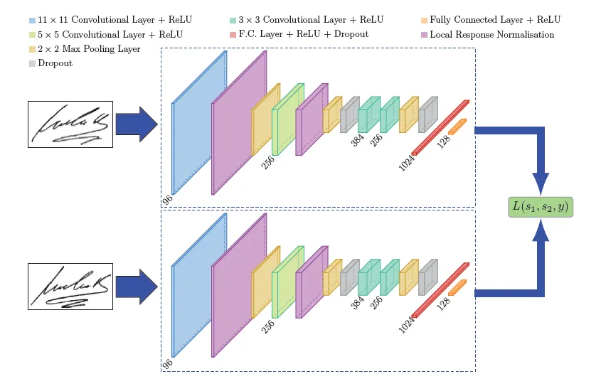
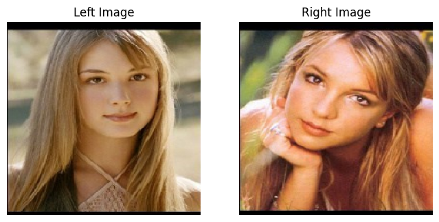
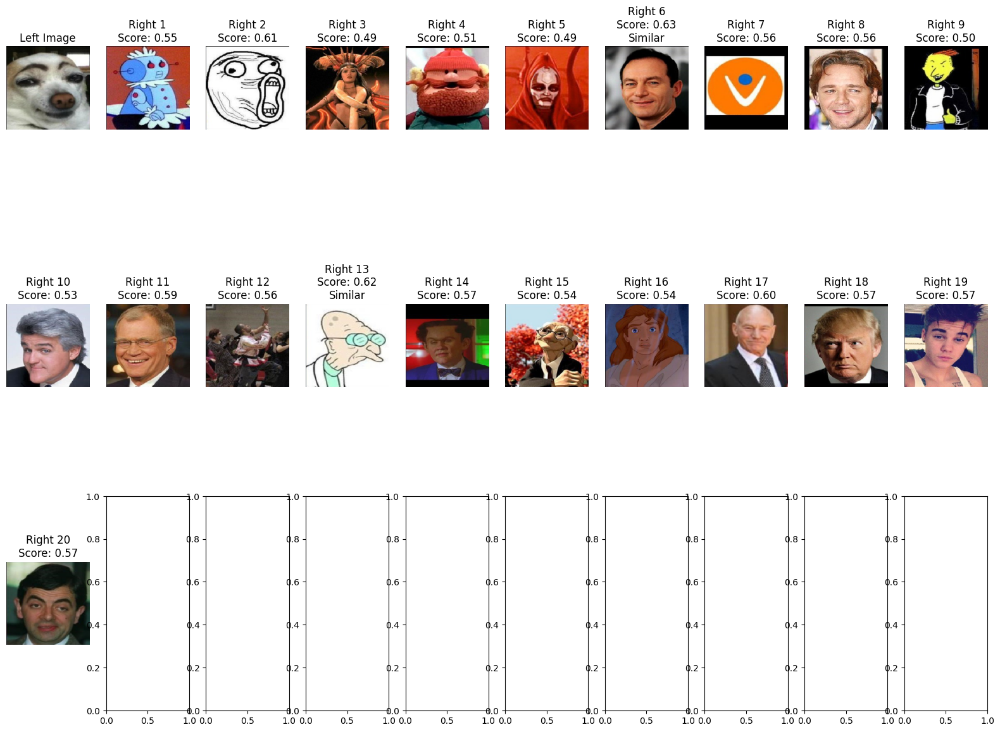

# Totally Looks Like: Siamese Network with ResNet50 and VGG19

The "Totally Looks Like" project aims to identify visually similar images using a Siamese neural network. The network combines features extracted from two pre-trained models, ResNet50 and VGG19, to enhance its similarity matching capabilities.


## Table of Contents
- [Overview](#overview)
- [Dataset](#dataset)
- [Installation](#installation)
- [Usage](#usage)
- [Advance Configuration](#advance-configuration)
- [Features](#features)


## Overview
- In this project, we've adopted the Siamese Network architecture for visual similarity matching. Our model takes as input one left image and a set of twenty right images. The objective is to identify the image among the twenty that most closely resembles the left image. The performance is evaluated using Top-2 K Categorical Accuracy, meaning that if any of the top two selected images is the correct match, the output is considered correct. 
- Below is an example of the siamese network architecture, it does not reflects our design of the model.
- 

- We have extensively evaluated the system using several pre-trained models, including EfficientNetV2S, VGG19, ResNet50, and MobileNetV3Large. This multi-model evaluation enables us to better understand how different architectures capture various aspects of visual similarity.

## Dataset
-   In this project we have utilized the Totally looks like dataset by Amir Rosenfeld, Markus D. Solbach, John K. Tsotsos
-   Follow the link to download the dataset for train, evaluate, and test.
-   https://sites.google.com/view/totally-looks-like-dataset
-   

## Installation
Install the required packages:

```bash
pip install -r requirements.txt
```

Please note 
-   If you want to use  GPU for this notebook with tensorflow, please follow the steps listed on the official website and install all required packages https://www.tensorflow.org/install/pip
-   Otherwise by just install requirements would be sufficient to run with cpu only. 

## Usage
All work is done in a Jupyter Notebook. To begin, launch Jupyter Notebook in the project directory:
```bash
jupyter notebook
```
Navigate to the notebook named CV.ipynb and execute the cells to train and evaluate the model

- After training you can see the result by using show_test_case which will generate the similarity score between the left and right image.
- 

## Advance Configuration
You can customize various parameters directly in the Jupyter Notebook, such as:

-   Number of training epochs.
-   Size of each mini-batch.
-   Learning rate for the optimizer.

## Features
- **Dual Model Architecture**: Uses ResNet50 for capturing higher-level features and VGG19 for more nuanced, texture-based features.
- **Custom Loss Function**: Employs a custom contrastive loss function to optimize the learning process.
- **High Flexibility**: Supports various configurations like the number of epochs, batch size, and learning rates.
- **Evaluation Metrics**: Inclusion of evaluation scripts to assess model performance based on Top-K Categorical Accuracy.
- **TensorFlow TPU Support**: Optimized for TensorFlow and capable of running on TPUs for faster computation.